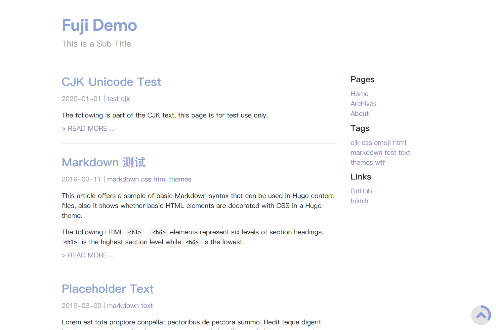

# Fuji

// ! THE THEME IS STILL IN EARLY DEV STAGE ! //

A minimal Hugo theme inspired by [printempw](https://github.com/printempw/)'s Hexo theme [Murasaki](https://github.com/printempw/hexo-theme-murasaki/), with responsive grid system and markdown style, powered by GitHub Primer CSS.

## Live demos

[Netlify]() | [My own blog]()



## Todo

- [ ] Archive page
- [ ] Analytics
- [ ] SEO optimization
- [ ] Better mobile devices support
- [ ] Multilingual

## Installation

Inside the folder of your Hugo site run:

```bash
$ git submodule add https://github.com/amzrk2/hugo-theme-fuji.git themes/fuji
```

For more information read the official [setup guide](https://gohugo.io/overview/installing/) of Hugo.

## Getting started

After installing the theme successfully it requires a just a few more steps to get your site running.

### The config file

Copy the ```config.toml``` in the ```exampleSite```to the root of your Hugo site. Change strings as you like.

### Local preview

In order to see your site in action, run Hugo's built-in local server:

```bash
$ hugo server
```

Now enter [```localhost:1313```](http://localhost:1313) in the address bar of your browser.

## Update the theme

Inside the folder of your Hugo site run:

```bash
$ git submodule update --remote --merge
```

## Contributing

Did you found a bug or got an idea for a new feature? Feel free to use the [issue tracker](https://github.com/amzrk2/hugo-theme-fuji/issues) to let me know.

## License

The theme is released under the ```GNU General Public License v3.0-only```, for more information read the [License](https://github.com/amzrk2/hugo-theme-fuji/blob/master/LICENSE).

## Annotations

Thanks to [printempw](https://github.com/printempw/) for the idea of theme.

Thanks to developers for creating Hugo and the awesome community around the project.
