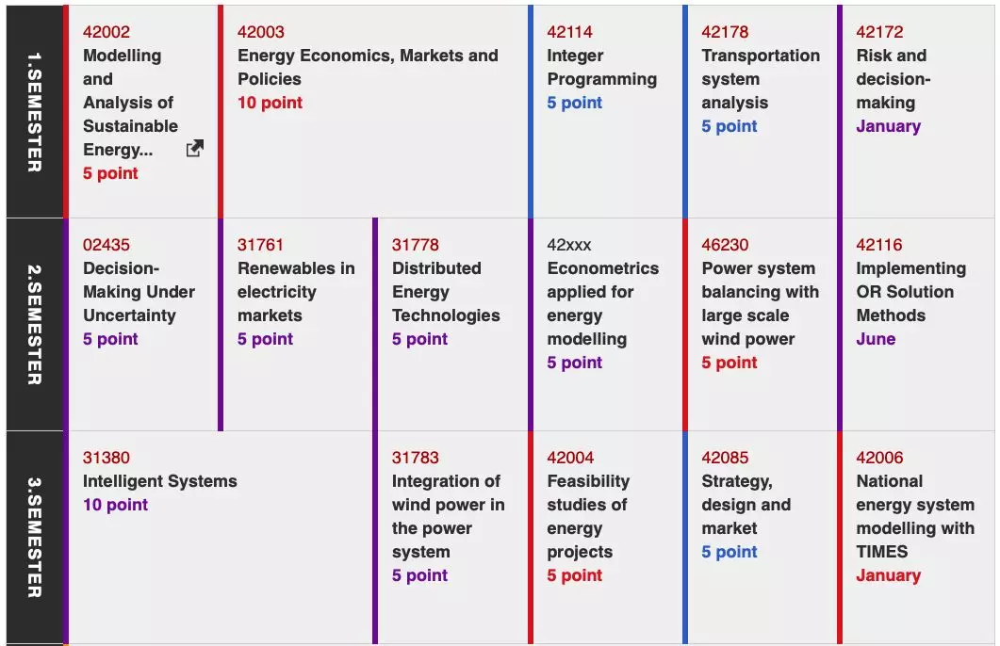
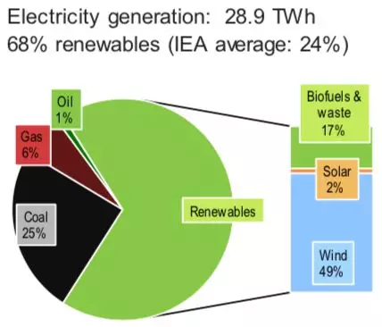
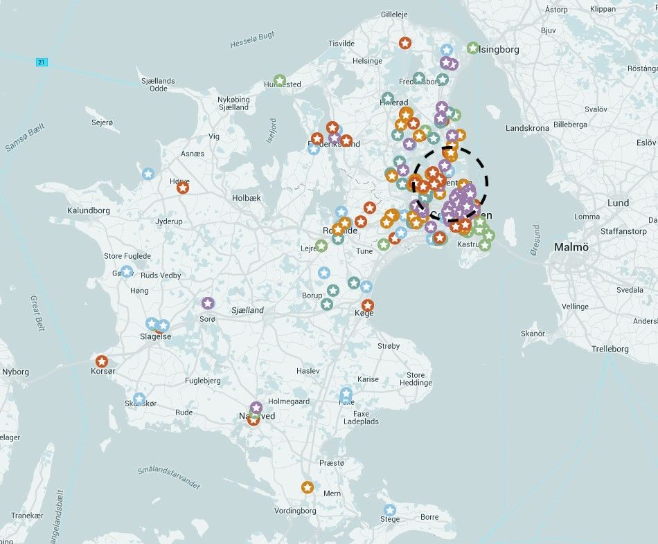
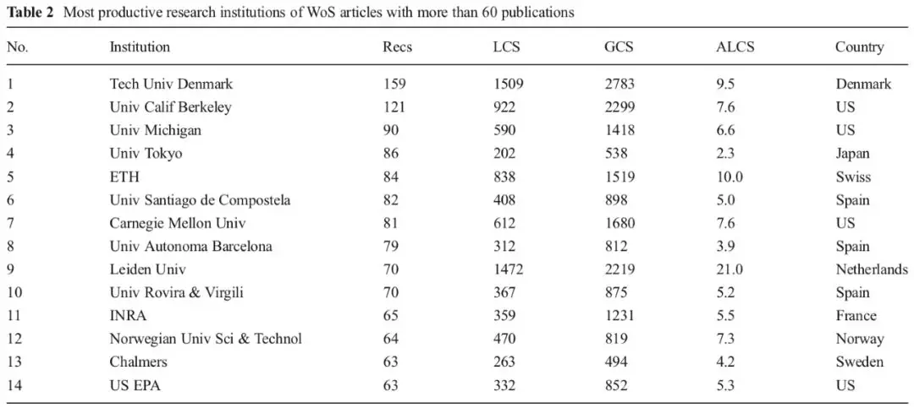
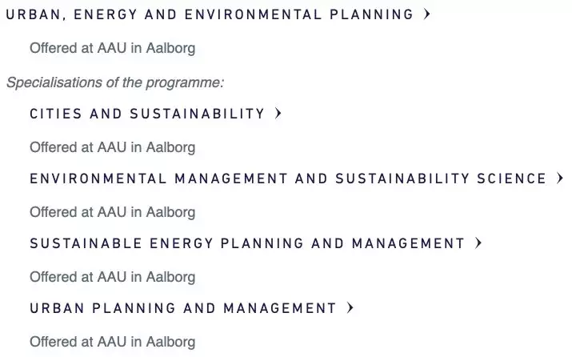
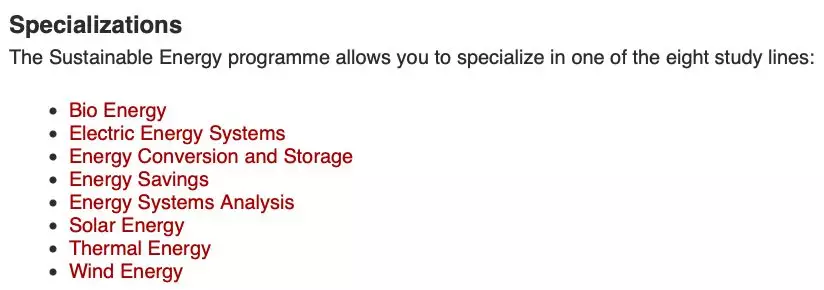
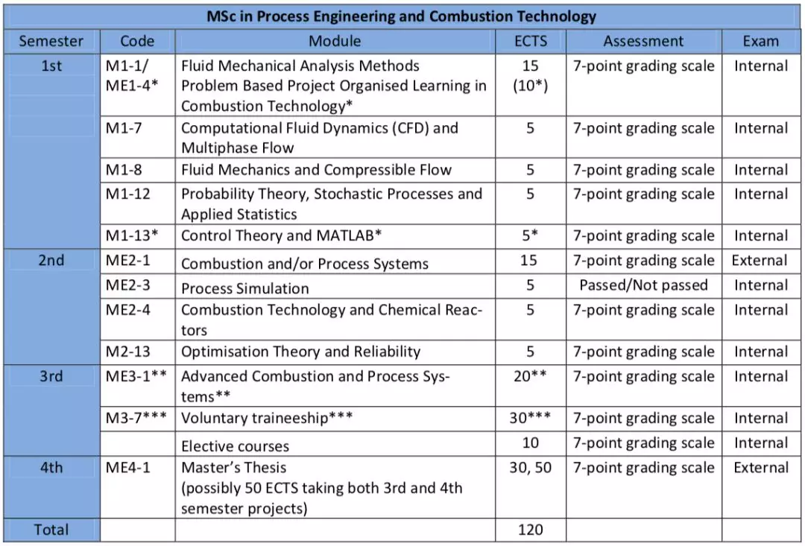

+++
title = "择校课程、产业现状和研究团队最重要"
date = 2019-01-04T00:00:00+08:00
tags = ["中文", "journal", "view"]
showToc = false
showLicense = false
+++

新能源是一个跨学科的领域，我在本科期间没有很明确的研究对象，所以研究生择校和专业选择的时候有很多选项，经过半学期 DIY 的摸索，我个人认为对于择校和专业选择来说，课程、产业现状和研究团队是最重要的。

<!--more-->

（本文由作者独立完成，原载于丹麦科技创业中心微信公众号，标题为[我和丹麦的那些故事（十五）](https://mp.weixin.qq.com/s/0BSqo9Xz521QwaWuY65Pqw)，时间是 2019 年 1 月 4 日，此转载未获许可，且禁止进一步转载。）

我本科毕业于重庆大学动力工程学院新能源科学与工程系，现就读于丹麦技术大学的新能源-能源系统分析专业，也被奥尔堡大学的能源工程-热能与过程工程专业录取。

---

国外硕士项目的主要内容还是上课，所以我认为课程要“全”而且“专”，才能满足研究生阶段的学习和研究需要。比如我的专业课程就包括了系统分析和系统优化的各个方面，又在能源规划、经济分析和可持续分析等方面有所侧重（如下图所示），我也可以设计自己的课程安排：

<figure> 

 </figure>

这样一来，不仅能学习各种各样的研究和分析方法，也能够在某个方法或者某个研究对象上有所突破，发展出自己独特的优势。

对于硕士毕业后打算找工作的同学，可以通过专业的研究机构收集统计资料，以了解学校所在地和国家的产业现状，相关产业发达更利于本地就业。比如我从国际能源署（IEA）了解了丹麦以及其他国家的能源发展现状，知道了丹麦在分布式能源、生物质能、电力电子技术、风能等等领域都处于世界领先地位（如下图所示），所以就下决心来丹麦读能源类的硕士项目：

<figure> 

 </figure>

对于更具体的产业现状，就需要通过更多途径地了解。如果这个国家的相关产业非常繁荣，就非常有利于找工作，比如丹麦号称有 1000 家能源类企业，如下图所示，丹麦技术大学就在其中黑色圆圈的位置：

<figure> 

 </figure>

除了我了解的能源领域外，在很多领域，比如航运造船（A.P.穆勒集团）、相机（光学）、音响（声学）、多功能涂料、家居家具、皮草等等工业产业都很发达。所以丹麦学校相关的专业应该都不会很差，学生毕业之后也很好找工作。

成熟的研究团队有能力开设系统的一系列课程，而不是离散的导论课，也能有更多的研究项目供同学选择。比如我的专业由丹麦技术大学管理学院的系统分析系开设，这个系原本隶属于丹麦里瑟国家能源实验室，这个最早由丹麦著名量子力学专家、诺贝尔奖得主玻尔创立的实验室于 2010 年被并入丹麦技术大学。这样的历史渊源就让我确信这个系的研究水平是很高的。

再深入了解的话，系统分析系中的可持续量化分析团队（Quantitative Sustainability Assessment）排名世界第一（下图所示），系主任 Michael Zwicky Hauschild 教授 H 指数高达 63 ，这样的优秀团队就提供了继续读博的好机会：[chen2014bibliometric](#参考文献)

<figure> 

 </figure>

再比如说奥尔堡大学规划系的 Henrik Lund 教授是能源领域第一期刊 Energy 的主编，H 指数高达 57。他所在的规划系开设的城市、能源与环境规划专业就非常好，包括了下图显示的四个方向，是一个多学科交叉的新型专业。我相信这种资深教授领导的新型硕士项目的毕业生在就业市场一定能占得先机：

<figure> 

 </figure>

除了详细了解课程、产业现状和研究团队外，还有很多方面需要注意。比如丹麦技术大学和奥尔堡大学的能源类并不是按照大类招生的，因为没有对于专业的规定，所以只看专业名称的话基本不具有参考意义。再比如丹麦技术大学有两个风能专业，一个是独立的风能专业，偏向于风机的设计，另一个是可再生能源的一个研究方向，如下图所示，偏向于风电场运营：

<figure> 

 </figure>

此外，多了解学校项目的话也非常有利于确定自己以后想从事的工作。比如我刚开始报名的时候非常想研究生物质热化学转换，但是在看了奥尔堡大学新能源-过程工程和燃烧技术的课程之后就放弃了这个想法，因为对于我来说太困难了，所以我知道了我的基础不适合研究生物质热化学转换：

<figure> 

 </figure>

总而言之，我认为每个人的情况都是不同的，不能轻信某个人或者留学中介的建议，要选择最适合自己的项目，在这个过程中，我认为课程、产业现状和研究团队是最重要。希望我的经历能带给大家一点启发，对留学丹麦和择校有更好的理解。

## 参考文献

- Chen, H., Yang, Y., Yang, Y., Jiang, W., & Zhou, J. (2014). A bibliometric
  investigation of life cycle assessment research in the web of science
  databases. The International Journal of Life Cycle Assessment, 19(10),
  1674-1685.
