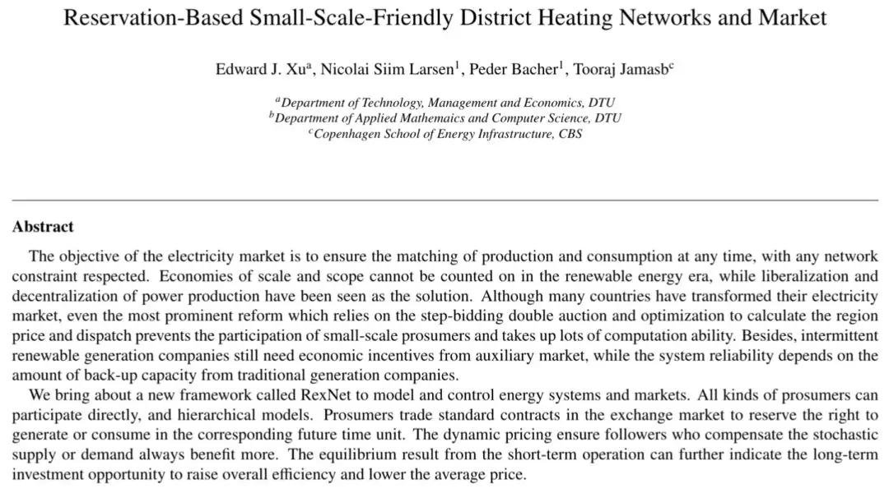
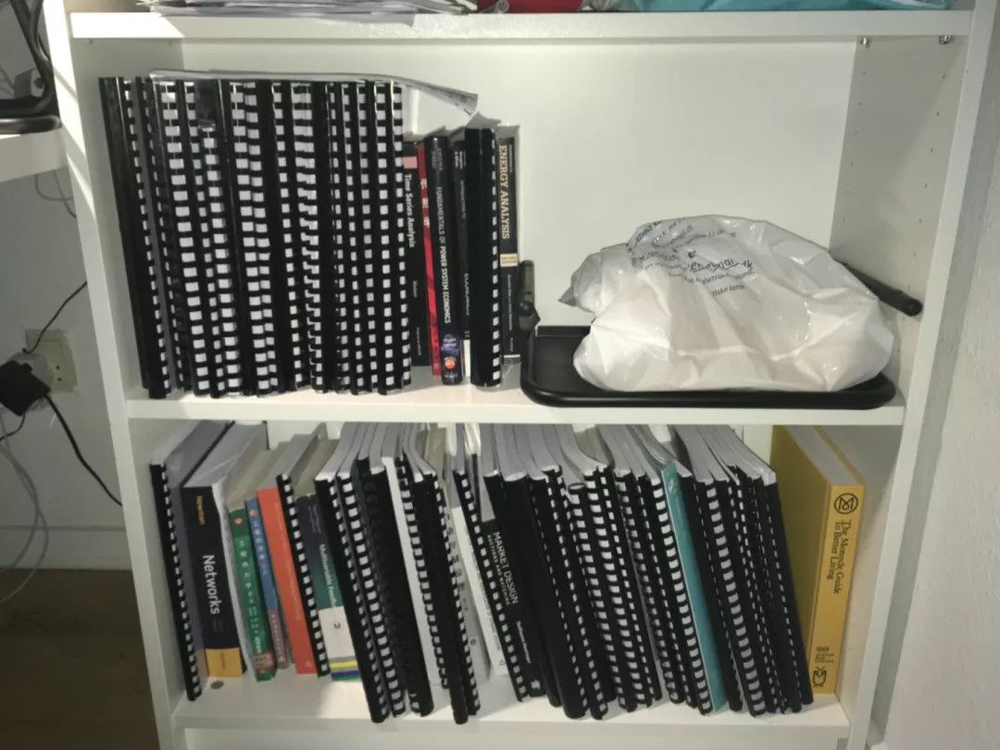
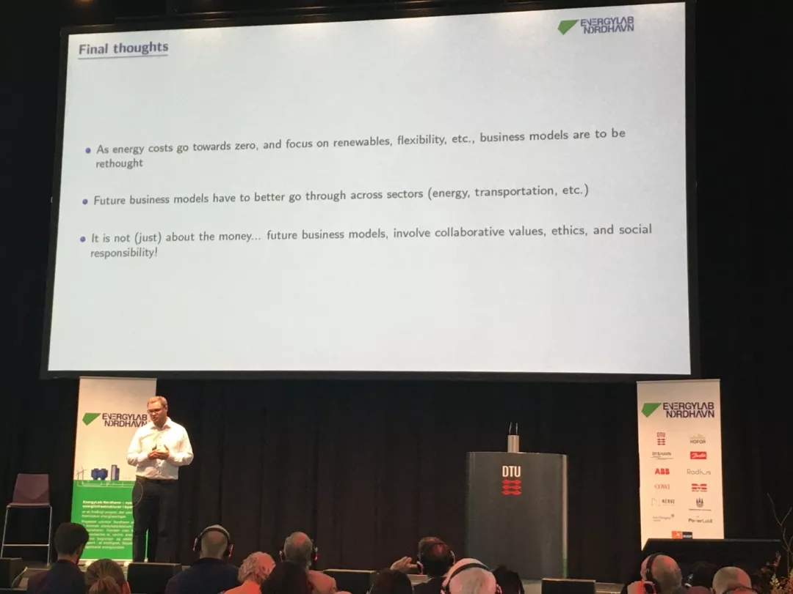
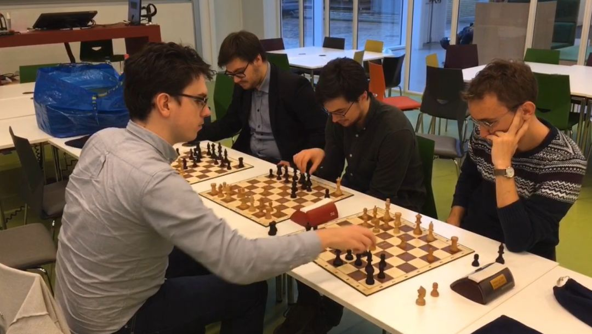

+++
title = "我和丹麦的那些故事（五十七）"
date = 2020-02-21
tags = ["中文", "journal", "view"]
showToc = true
showLicense = false
+++

构思了一年多的硕士毕设提案终于通过了开题审核，接下来的任务就是把它变成现实。从一次睡觉前的灵感爆棚，到现在的 12 页开题报告，这一年多在丹麦的学习生活很不容易。每天入睡前都要思考两个问题，想法可不可行，有没有类似的想法。但只靠想是不够的，更需要阅读和写作，以及朋友的帮助。

<!--more-->

（本文由作者独立完成，原载于丹麦科技创业中心微信公众号，标题为[我和丹麦的那些故事（五十七）](https://mp.weixin.qq.com/s/9z2UbjRkNrBAUrhvXAvRVw)，时间是 2020 年 2 月 21 日，此转载未获许可，且禁止进一步转载。）

<figure> 

<figcaption>硕士毕设提案截图</figcaption>

 </figure>

从小想法到硕士提案，我认为靠的是坚定的信心、灵活的思维和多元化的团队。这里的思维灵活是指能够快速地从其他领域吸收有用的方法，不能局限于自己“一亩三分地”。在迷茫甚至是质疑声中坚定自己的信心是一大挑战，没有人会主动告诉你这个想法可行，这个想法的前景如何，下一步怎么办，这些都需要自己去决定。好消息是，在学术领域，没有绝对的错误或正确，更重要的是缜密的论证和讨论，如果最终证明了想法在某方面行不通，那也是一种贡献。

丹麦人对无领导小组合作的学习工作方式走火入魔，这有利也有弊，我选择了尽量避开这种学习方式。我把硕士前期的主要任务定为提高编写计算机代码的能力，中期再开始扩大交际圈，提高语言能力。总体来说，我的丹麦学习生活非常与众不同，我想在以下三个方面简单地介绍一下，并给大家提几个小建议。

## 阅读，写作

我认为阅读和写作是我这一年中用到的最重要的两项技能。英国以外欧洲国家的学生英语水平有限，所以老师尽量不强制学生阅读很多材料，很多课甚至都没有阅读材料，学生想要掌握内容只能靠老师讲和上课听。然而，很多老师的主要工作语言可能都不是英语，他们自己都很难把概念讲清楚。我花了大量的时间给每门课配了阅读材料，帮助我预习和复习课上的内容。读英文阅读材料虽然耗时费力，但是逻辑清晰且前后连贯，特别是学术书籍，很大的优势是符号和概念统一。

<figure> 

<figcaption>我所有的阅读材料，差不多读完了60%，很多已经被翻烂了</figcaption>

 </figure>

在这一年中，我的阅读能力得到了飞速的提高，从一开始反复阅读概论级别的学术书籍，提升到近几个月大范围的文献阅读。此外，我还发现很多我想不通的概念很早以前就有人讲清楚了，只是藏在图书馆的角落里面等待被发现，因为阅读不仅仅包括把眼前的文章读完，更需要的是发现有用的文章，对比类似的观点。我的毕设副导师是个哥本哈根商学院的一位经济学教授，这几次见面中，他给我最多的建议就是“keep reading”（持续地阅读）。

我之前对英文写作的态度非常不端正，总是刻意回避写作任务，主要还是因为写作对思维输出的能力要求最高，但这也意味着写作是最重要的学习工具，只有当你把想法用自己的方式表达出来的时候，才意味着掌握了它。写作不仅仅局限于白纸黑字，还包括概念图、表格、计算机代码和数学表达，快速掌握同行们通用的表达方式是了解这个领域核心思想的重要方法。

## 选课自由度

对我的学习影响最大的就是硕士项目的选课自由度。据我了解，总体上丹麦学校的专业的选课非常自由，必修课学分的占比很低，虽然这也引入了很多问题，但至少尊重了学生的意愿。在研究生阶段，我认为个人兴趣能够极大地调动自身积极性。提醒大家在择校和选专业的时候看准各种限制，花钱去学自己不喜欢的课太不值得了。

我所在的可持续能源系是丹麦技术大学人数最多的一个系，这应该是选课限制较多的主要原因，这个问题让我十分困扰，甚至一度想转学。我坚持了下来，挤时间旁听了自己认为很关键的课程。另外，很多老师是不开课的，他们只会受邀请在其他老师的课上或者大型活动中作演讲，这些公共活动是了解老师的好机会，对以后的选课或者选毕设导师有很大帮助。

<figure> 

<figcaption>DTU 高科技峰会上 Pierre Pinson 教授的主题演讲</figcaption>

 </figure>

## 参加有组织的活动

这学期，一个偶然的机会让我发掘了一个小爱好，下国际象棋。学期开始的时候好朋友邀请我去，下意识是拒绝的，因为上次下国际象棋还是小学，但他保证帮我匹配实力相近的对手，最终我勉强答应。第一次去的前天夜里，我打开视频网站，搜索了国际象棋的讲解，死记硬背了几个开局套路，熟悉了一下相关的词汇，第二天硬着头皮就去了。结果同学们都非常友好，相互介绍了一番，初步了解一下对方的水平，就开始对弈。中途有说有笑，聊专业，吐槽天气，有疑惑了就相互解说一下自己的思考，气氛十分融洽。我那天赢了两盘，大家都互相称赞，约好下周再战。

<figure> 

<figcaption>DTU 国际象棋俱乐部头号选手同时对战三人，且为 3-10 分钟快棋，最终两胜，另一个未达成目标</figcaption>

 </figure>

万事开头难，任何人都很难接受自己不熟悉的事物；一旦入了门，也能很快就会融入到那个群体之中。我这一年多里从不同的领域吸收有用的技巧，应用到自己的想法中，也是相似的过程。经过一学期的训练，我收获的不仅仅是技艺的提高，还学会了对下棋进行系统性地描述和交流意见，更重要的是，认识了棋社的所有同学。除了棋社以外，我还听说有同学参加射箭俱乐部和羽毛球俱乐部。参加活动不仅能锻炼身体，更重要的是融入到当地的群体之中。

总而言之，丹麦人很重视观点的多元性，但是结果往往是各执己见，无法达成共识，采取行动更无从谈起。这一年的学习生活让我坚信个人力量对于推动创新来说必不可少，同时，朋友的帮助能够锦上添花。丹麦人的学习生活方式和国内的有很大不同，希望大家能够分清优劣，走自己的道路。

---

2021 年 3 月 6 日注：2020 年挑战很多，但我成功在圣诞节前毕业。请看我另一篇英文总结，[2.5 years at DTU](https://edxu96.github.io/post/study/)，更新、更深入。
