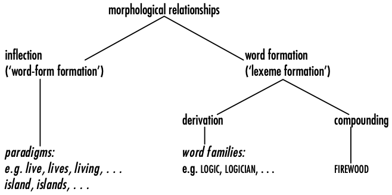

+++
title = "What is \"cmdict\""
date = 2021-05-24
tags = ["linguistics", "cmdict"]
math = false
draft = true
+++

`cmdict` is a computational tool for personal vocabulary construction. The
knowledge required for mastering can be divided into two parts, vocabulary and
grammar. `cmdict` can only help with the vocabulary part for now.

<!--more-->

All the crawled content is cross-validated.

<!--more-->

## Introduction

- Different Python enumerations are designed.

## Phonetics

### IPA

> The International Phonetic Alphabet (IPA) is an alphabetic system of phonetic
> notation based primarily on the Latin script. It was devised by the
> International Phonetic Association in the late 19th century as a standardized
> representation of speech sounds in written form.
> [wikipedia2021international](#references)

### Syllabification

> In some languages, the spoken syllables are also the basis of syllabification
> in writing. However, possibly due to the weak correspondence between sounds
> and letters in the spelling of modern English, written syllabification in
> English is based mostly on etymological or morphological instead of phonetic
> principles. For example, it is not possible to syllabify "learning" as
> lear-ning according to the correct syllabification of the living language.
> [wikipedia2021syllabification](#references)

## Morphology

> In linguistics, morphology is the study of words, how they are formed, and
> their relationship to other words in the same language. It analyzes the
> structure of words and parts of words such as stems, root words, prefixes,
> and suffixes. Morphology also looks at parts of speech, intonation and
> stress, and the ways context can change a word's pronunciation and meaning.
> [wikipedia2021morphology](#references)

More important for syntax language like German.

> Morphological descriptions should contain a rule saying that English
> nouns form their plural by adding -s, rather than simply listing the
> plural forms for each noun in the dictionary (abbot, abbots; ability,
> abilities; abyss, abysses; accent, accents; ...)
> [haspelmath2013understanding](#references)

<figure> 

<figcaption>
Figure 1, subdivisions of morphology (from
<a href="#references">haspelmath2013understanding</a>).
</figcaption>

 </figure>

### Degree of Synthesis

### Inflection

> Word-forms in an inflectional paradigm generally share (at least) one longer
> morpheme with a concrete meaning and are distinguished from each other in
> that they additionally contain different shorter morphemes, called affixes.
> [haspelmath2013understanding](#references)

It can also provide hints on how a complex or inflected word is composed of.

- Conjugation, the inflection of a verb, which is very important in German, for
  example.
- Declension, for word in other PoS.

### Derivation

### Compounding

Generally, it is hard to tell if a root word is combined with an affix or
another root word. In particular, such issue cannot be handled by algorithmic
stemming. For example, there is [a section in `Snowball` on compound words in
German](https://snowballstem.org/algorithms/germanic.html), saying it is not
necessary to focus too much on compound words. Still, from the author's
perspective, to handle compound words is very important in German.

## Collocation

## Word-Set

### `yaml` File

To execute a batch of commands. More convenient than `sh` or `batch` files.

### Direct Extraction

### User History

## Word Formation

## Modifiable Printouts

### Different Formats

## References

- Wikipedia contributors. (2021, May 12). Inflection. In Wikipedia, The Free
  Encyclopedia. Retrieved 18:13, May 24, 2021, from
  https://en.wikipedia.org/w/index.php?title=Inflection&oldid=1022730407
- Wikipedia contributors. (2021, May 24). International Phonetic Alphabet. In
  Wikipedia, The Free Encyclopedia. Retrieved 18:19, May 24, 2021, from
  https://en.wikipedia.org/w/index.php?title=International_Phonetic_Alphabet&oldid=1024804130
- Wikipedia contributors. (2021, May 18). Morphology (linguistics). In
  Wikipedia, The Free Encyclopedia. Retrieved 18:20, May 24, 2021, from
  https://en.wikipedia.org/w/index.php?title=Morphology_(linguistics)&oldid=1023884002
- Wikipedia contributors. (2021, March 21). Syllabification. In Wikipedia, The
  Free Encyclopedia. Retrieved 04:53, June 4, 2021, from
  https://en.wikipedia.org/w/index.php?title=Syllabification&oldid=1013381435
- Haspelmath, M., & Sims, A. (2013). Understanding morphology. Routledge.
