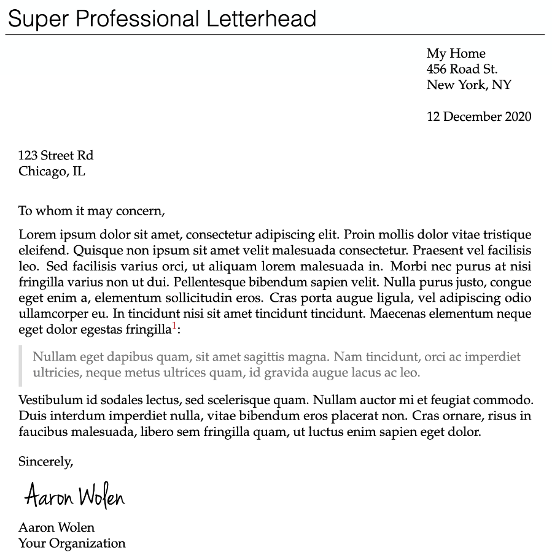

+++
title = "Resume and Cover Letter"
date = 2021-03-11
tags = ["view"]
+++

The resume played an important role in my last year at the university, because
it forces me to think about what I can do and want. The best way to improve it
is to receive feedback from others. In addition, there are some key points that
I want to talk about. Some advice on cover letter writing is given in the last
section.

<!--more-->

## Personal Information

I think only four pieces of personal information are essential:

- E-mail address.
- City and country of residence.
- Phone number. HRs in some countries prefer to calls.
- Personal website and other links.

In particular, avoid the disclose of private information, like the detailed
address.

## Specific but Condensed

Skills and tools used in finished projects and internships should be very
specific. For example:

> Build digital twin for power grids in western Denmark. (client: Danish Energy
> Agency) @ Power flow calculation and optimal investment decision.

versus

> Build digital twin for power grids in western Denmark with Python,
> PostgreSQL, and Google Cloud. (client: Danish Energy Agency) @ Power flow
> calculation, optimal investment

In order to spare some space, five techniques in my mind in a sequence of their
difficulties can be helpful:

1. Fill every line.
2. Condense descriptions for whatever happened long time ago.
3. Adjust margins.
4. Adjust sizes of fonts.
5. Tailor different versions for different types of positions, so only the most
   relevant terms are highlighted.

Here is an example for the first method:

> Technical University of Denmark  
> Sept 18 ­- Dec 20

versus

> Technical University of Denmark ... Sept 18 ­- Dec 20

## Separation by Bullets

For example:

> A Python package to model power grids as multilayer networks. All the
> electric devices at one voltage level compose one layer. Moreover, it
> provides an interface for power system analysis, sensitivity analysis, etc. @
> Unbalanced distribution networks can be modelled using impedance, and a bus
> impedance matrix can represent the whole power grid, then it is used to
> calculated power flow for given snapshot(s).

Conjunctions and long sentences can be avoided to a larger extent:

> A Python package to model power grids as multilayer networks. @ All the
> electric devices at one voltage level compose one layer. @ An interface for
> power system analysis, sensitivity analysis, etc. @ Bus impedance matrix for
> unbalanced distribution networks.

## Cover Letter

In my mind, resume should be focused on what you have done, and put everything
else in the cover letter. Moreover, [tomaska2018ten](#references) is a good
starting point for how to write cover letters (for an academic position).

The tool I used to write and render cover letter is
[`pandoc-letter`](https://github.com/aaronwolen/pandoc-letter). Here is the
example from its repository:

There are at least two advantages:

- It provides a standard layout for letters. 
- It can be easily modified and compiled.
- The version control can be easily applied. For similar positions, the same
  branch can be focused on.

---

There are some pitfalls of writing that I would avoid:

- Too many sentences starting with "I".
- Repeating contents in the resume: only the most related experiences should be
  highlighted again.
- No connections to the position: relate personal experiences to the position
  from time to time (at least mention the position several times).
- Hyperlinks not shown as endnotes: in case the reader print the letter.
- Ambiguous "what I want": always state "what I want" in the very beginning.
- The disclosure of detailed personal address: it is not necessary, because the
  reader will reply through emails.

## References

- Tomaska, L., & Nosek, J. (2018). Ten simple rules for writing a cover letter
  to accompany a job application for an academic position. To read it online,
  https://journals.plos.org/ploscompbiol/article?id=10.1371/journal.pcbi.1006132

---

- On April 9, 2020, some minor updates.
- On April 20, 2020, add some pitfalls of letter writing.
